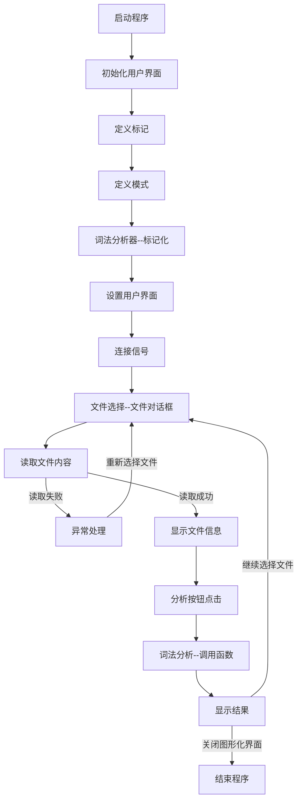

# 程序流程图

```mermaid
graph TD
    A[启动程序] --> B[初始化用户界面]
    B --> C[定义标记]
    C --> D[定义模式]
    D --> E[词法分析器--标记化]
    E --> F[设置用户界面]
    F --> G[连接信号]
    G --> H[文件选择--文件对话框]
    H --> I[读取文件内容]
    I --> |读取失败|P[异常处理]
    I --> |读取成功| J[显示文件信息]
    P --> |重新选择文件|H
    J --> K[分析按钮点击]
    K --> L[词法分析--调用函数]
    L --> M[显示结果]
    M --> |继续选择文件|H
    M --> |关闭图形化界面|N[结束程序]
```
