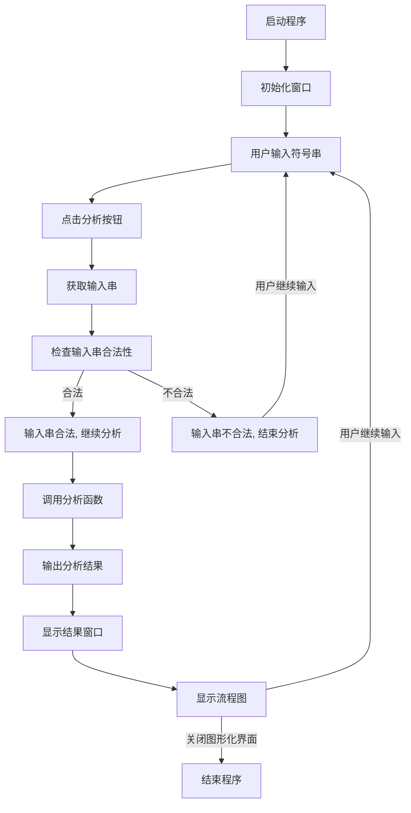

# 分析程序流程图

```mermaid
graph TD
    A[启动程序] --> B[初始化窗口]
    B --> C[用户输入符号串]
    C --> D[点击分析按钮]
    D --> E[获取输入串]
    E --> F[检查输入串合法性]
    F --> |合法| G[输入串合法, 继续分析]
    F --> |不合法| H[输入串不合法, 结束分析] --> |用户继续输入|C
    G --> I[调用分析函数]
    I --> J[输出分析结果]
    J --> K[显示结果窗口]
    K --> L[显示流程图] --> |用户继续输入|C
    L --> |关闭图形化界面|M[结束程序]
```