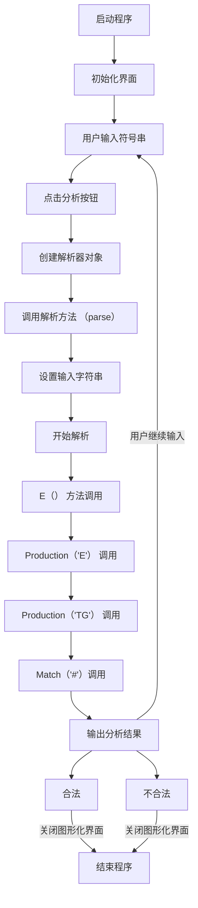

# 解析程序流程图

```mermaid
graph TD
    A[启动程序] --> B[初始化界面]
    B --> C[用户输入符号串]
    C --> D[点击分析按钮]
    D --> E[创建解析器对象]
    E --> F[调用解析方法 （parse）]
    F --> G[设置输入字符串]
    G --> H[开始解析]
    H --> I[E（） 方法调用]
    I --> J[Production（'E'） 调用]
    J --> K[Production（'TG'） 调用]
    K --> L[Match（'#'）调用]
    L --> M[输出分析结果] --> |用户继续输入|C
    M --> yes[合法]
    M --> no[不合法]
    yes --> |关闭图形化界面|N[结束程序]
    no --> |关闭图形化界面|N[结束程序]
```
